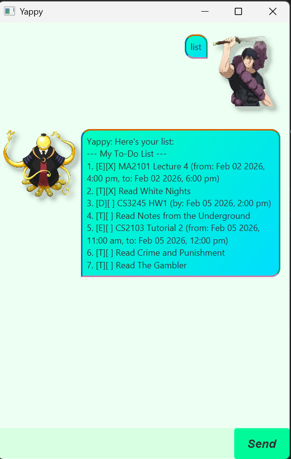

<h1 align="center">
  <br>
  
  <br>
  🗣️ Yappy
  <br>
</h1>

<h4 align="center">Your friendly task management chatbot that loves to yap! Built with <a href="https://openjfx.io/">JavaFX</a>.</h4>

<p align="center">
  
  
  
  
</p>

<p align="center">
  <a href="#-quick-start"></a>
  <a href="#-features"></a>
  <a href="#-command-summary"></a>
  <a href="#-task-reference"></a>
</p>

---

## 🚀 Quick Start

<table>
<tr>
<td>

> 💡 **Prerequisites:** Java 17 or above installed on your system

```bash
# Download and run
java -jar yappy.jar
```

| Step | Action |
|:----:|:-------|
| 1️⃣ | 📥 Download the latest `yappy.jar` from releases |
| 2️⃣ | 💻 Open a terminal in the download folder |
| 3️⃣ | ▶️ Run `java -jar yappy.jar` |
| 4️⃣ | 💬 Start yapping with Yappy! |

</td>
</tr>
</table>

---

## ✨ Features

<details>
<summary>📋 <b>List all tasks</b> — </summary>

<br>

Shows all tasks in your task list.

> **Format:** 

**Output:**
```diff
--- My To-Do List ---
+ 1. [T][ ] read book
+ 2. [D][ ] submit report (by: Dec 10 2024, 5:00 PM)
+ 3. [E][ ] team meeting (from: Dec 10 2024, 2:00 PM to: Dec 10 2024, 3:00 PM)
```
</details>

<details>
<summary>📝 <b>Add a todo</b> — </summary>

<br>

Adds a simple todo task without any date/time attached.

> **Format:** 

**Example:**
```
todo read book
```

**Output:**
```diff
+ Got it! `read book` is in the list
```
</details>

<details>
<summary>⏰ <b>Add a deadline</b> — </summary>

<br>

Adds a task with a deadline.

> **Format:** 

> 📅 **Date format:** `YYYY-MM-DDTHH:MM` (e.g., `2024-12-10T17:00`)

**Example:**
```
deadline submit report /by 2024-12-10T17:00
```

**Output:**
```diff
+ Got it! `submit report` is in the list
```
</details>

<details>
<summary>📅 <b>Add an event</b> — </summary>

<br>

Adds an event with a start and end time.

> **Format:** 

> 📅 **Date format:** `YYYY-MM-DDTHH:MM`

**Example:**
```
event team meeting /from 2024-12-10T14:00 /to 2024-12-10T15:00
```

**Output:**
```diff
+ Got it! `team meeting` is in the list
```
</details>

<details>
<summary>✅ <b>Mark task as done</b> — </summary>

<br>

Marks a task as completed.

> **Format:** 

**Example:**
```
mark 1
```

**Output:**
```diff
+ slayyy, cleared tasks? that's productivity core fr
+ [T][X] read book
```
</details>

<details>
<summary>↩️ <b>Unmark a task</b> — </summary>

<br>

Marks a task as not done.

> **Format:** 

**Example:**
```
unmark 1
```

**Output:**
```diff
! lowkey proud of you for even adding it instead of ignoring it
! [T][ ] read book
```
</details>

<details>
<summary>🗑️ <b>Delete a task</b> — </summary>

<br>

Removes a task from the list.

> **Format:** 

**Example:**
```
delete 1
```

**Output:**
```diff
- sheeeesh, task deleted? that's main character productivity energy fr
- [T][ ] read book
- Now you've got 2 tasks vibin' in the list.
```
</details>

<details>
<summary>🔍 <b>Find tasks</b> — </summary>

<br>

Searches for tasks containing the given keyword.

> **Format:** 

**Example:**
```
find book
```

**Output:**
```diff
@@ Here are the matching tasks in your list: @@
+ 1. [T][ ] read book
```
</details>

<details>
<summary>👋 <b>Exit application</b> — </summary>

<br>

Closes Yappy.

> **Format:** 

**Output:**
```
Ohhh you're going now! Anw thanks for yapping with me
```
</details>

---

## 📚 Task Reference

### Task Types

| Icon | Symbol | Type | Badge | Description |
|:----:|:------:|:-----|:-----:|:------------|
| 📝 | `[T]` | Todo |  | Simple task without date |
| ⏰ | `[D]` | Deadline |  | Task with a due date |
| 📅 | `[E]` | Event |  | Task with start and end time |

### Task Status

| Symbol | Badge | Status | Meaning |
|:------:|:-----:|:-------|:--------|
| `[X]` |  | ✅ Completed | Task is done! |
| `[ ]` |  | ⬜ Pending | Task not done yet |

---

## 💾 Data Storage

<table>
<tr>
<td>


Tasks are **automatically saved** to `data/tasks.txt` and loaded when you restart Yappy.

**No manual saving required!** 🎉
</td>
</tr>
</table>

---

## 📖 Command Summary

| Command | Badge | Format | Description |
|:--------|:-----:|:-------|:------------|
| 📋 List |  | `list` | Show all tasks |
| 📝 Todo |  | `todo <description>` | Add a simple task |
| ⏰ Deadline |  | `deadline <desc> /by <date>` | Add task with deadline |
| 📅 Event |  | `event <desc> /from <start> /to <end>` | Add an event |
| ✅ Mark |  | `mark <number>` | Mark task as done |
| ↩️ Unmark |  | `unmark <number>` | Mark task as not done |
| 🗑️ Delete |  | `delete <number>` | Remove a task |
| 🔍 Find |  | `find <keyword>` | Search for tasks |
| 👋 Exit |  | `exit` | Close Yappy |

---

<p align="center">
  
  
</p>
